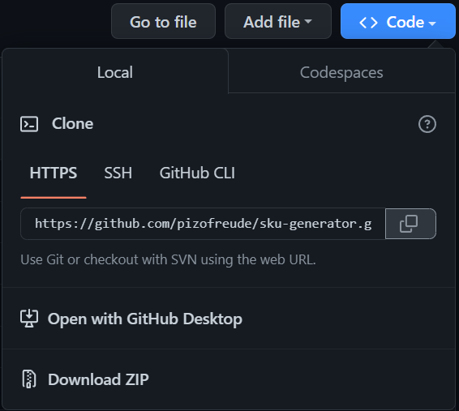

# SKU Generator

SKU-Generator.py is a script generates unique SKU codes based on a CSV file with columns containing product information.

It also includes a function to replace colors with color codes.

SKU (Stock Keeping Unit) is a unique identifier that is used to track inventory in warehouses, retail stores, or even eCommerce stores.

SKU can be used to populate item code in many accounting software such as [Manager.io](https://www.manager.io/).

## Features

* Generate SKUs based on custom rules and templates
* Automatically assign sequential numbers to SKUs to ensure uniqueness
* Support for a wide range of attribute types, including strings, numbers, and dates
* Configurable delimiter characters between attributes in SKUs
* Export generated SKUs to a CSV file for easy integration into other systems

## Requirements

The script was developed using Python3 (3.11) in a virtual environment.

Should you want to use this script, ensure your machine support any version of python3.

Additionally, run this command in your terminal to fulfill the script dependencies:

```bash
pip install -r requirements.txt
```

## Usage

### Fork this repo

Click the "Fork" icon in the upper right of the page.

This will create a fork of the project under your user account.

### Cloning it locally

Next, clone your local version down to your local machine:

```bash
git clone https://github.com/<Your-GitHub-Username>/sku-generator.git
```

Alternatively, you can simply download the project as ZIP file and unzip it to use as depicted below:



## User Guide

1. Open the CHARTS directory and customize two CSV files namely categories-subcategories.csv and colors.csv according to your use case scenario in any text editor ([Excel spreadsheet](https://support.microsoft.com/en-us/office/import-or-export-text-txt-or-csv-files-5250ac4c-663c-47ce-937b-339e391393ba) or Notepad).
2. Next, fill in your product info in the sku_gen_template.csv accordingly.
3. Run the sku-gen.py script in the terminal. Open your terminal and navigate to the script directory, then enter:

```bash
python sku-gen.py
```

4. Your result will be saved in the same folder of sku-gen.py with the following name:

```bash
sku_gen_template_result.csv
```

For more information on how to use SKU-Generator, please refer to the [documentation](./docs/).

## Contributing

If you would like to contribute to SKU-Generator, please submit a pull request with your changes. Before submitting a pull request, please make sure that your changes are covered by unit tests and follow the [code style guidelines](https://docs.python-guide.org/writing/style/).

## License

SKU-Generator is licensed under the MIT license. See the [LICENSE file](https://github.com/pizofreude/sku-generator/LICENSE) for more information.

By contributing, you agree that your contributions will be licensed under its MIT License.


